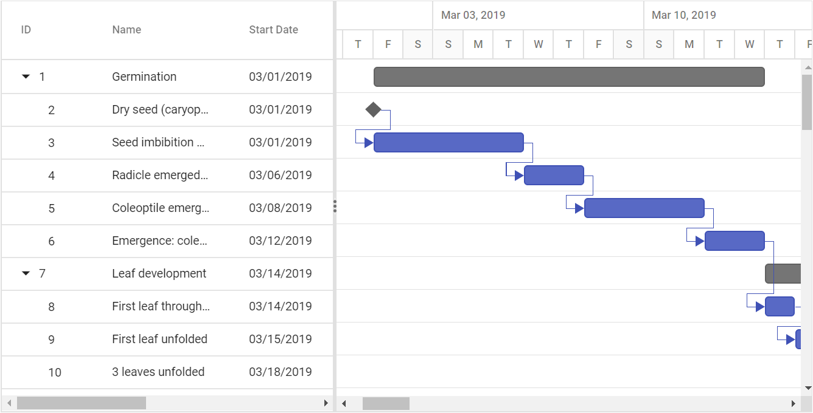

# Data Binding

The Gantt control uses `DataManager` for binding the data source, which supports both RESTful JSON data services and local JavaScript object array. The [`DataSource`](https://help.syncfusion.com/cr/aspnetcore-js2/Syncfusion.EJ2.Gantt.Gantt.html#Syncfusion_EJ2_Gantt_Gantt_DataSource) property can be assigned either with the instance of DataManager or JavaScript object array collection. The Gantt control supports binding two types of data:
* Local data
* Remote data

## Local data

To bind local data to Gantt, you can assign a JavaScript object array to the [`DataSource`](https://help.syncfusion.com/cr/aspnetcore-js2/Syncfusion.EJ2.Gantt.Gantt.html#Syncfusion_EJ2_Gantt_Gantt_DataSource) property. The local data source can also be provided as an instance of the `DataManager`.

In local data binding, the data source for rendering the Gantt control is retrieved from the same application locally.

The following are the two types of data binding possible with the Gantt control:

* Hierarchical data binding.
* Self-referential data binding (Flat data).

### Hierarchical data binding

The [`Child`](https://help.syncfusion.com/cr/aspnetcore-js2/Syncfusion.EJ2.Gantt.GanttTaskFields.html#Syncfusion_EJ2_Gantt_GanttTaskFields_Child) property is used to map the child records in hierarchical data.

The following code example shows how to bind the hierarchical local data into the Gantt control.





### Self-referential data binding (Flat data)

The Gantt control can be bound with self-referential data by mapping the data source field values to the [`Id`](https://help.syncfusion.com/cr/aspnetcore-js2/Syncfusion.EJ2.Gantt.GanttTaskFields.html#Syncfusion_EJ2_Gantt_GanttTaskFields_Id) and [`ParentID`](https://help.syncfusion.com/cr/aspnetcore-js2/Syncfusion.EJ2.Gantt.GanttTaskFields.html#Syncfusion_EJ2_Gantt_GanttTaskFields_ParentID) properties.

* ID field: This field contains unique values used to identify each individual task and it is mapped to the [`Id`](https://help.syncfusion.com/cr/aspnetcore-js2/Syncfusion.EJ2.Gantt.GanttTaskFields.html#Syncfusion_EJ2_Gantt_GanttTaskFields_Id) property.
* Parent ID field: This field contains values that indicate parent tasks and it is mapped to the [`ParentID`](https://help.syncfusion.com/cr/aspnetcore-js2/Syncfusion.EJ2.Gantt.GanttTaskFields.html#Syncfusion_EJ2_Gantt_GanttTaskFields_ParentID) property.





## Remote data

To bind remote data to the Gantt component, assign service data as an instance of `DataManager` to the [`DataSource`](https://help.syncfusion.com/cr/aspnetcore-js2/Syncfusion.EJ2.Gantt.Gantt.html#Syncfusion_EJ2_Gantt_Gantt_DataSource) property.





### URL Adaptor

In Gantt, we can fetch data from SQL database using `ADO.NET` Entity Data Model and update the changes on CRUD action to the server by using `DataManager` support. To communicate with the remote data we are using `UrlAdaptor` of DataManager property to call the server method and get back resultant data in JSON format. We can know more about `UrlAdaptor` from [`here`](https://ej2.syncfusion.com/javascript/documentation/data/adaptors/?no-cache=1).

> Please refer the [link](https://docs.microsoft.com/en-us/aspnet/mvc/overview/older-versions-1/models-data/creating-model-classes-with-the-entity-framework-cs) to create the `ADO.NET` Entity Data Model in Visual studio,

We can define data source for Gantt as instance of DataManager using `url` property of DataManager. Please Check the below code snippet to assign data source to Gantt.





### Sending additional parameters to the server

We can pass additional parameters using [`addParams`](../api/data/query/#addparams) method of [`Query`](../api/data/query/) class.
In server side we have inherited and shown the additional parameter value in Syncfusion DataManager class itself. We pass an additional parameter in load time using [`load`](../api/gantt#load) event. We can also pass additional parameter to the CRUD model. Please Check the below code snippet to send additional parameter to Gantt.





#### Handling HTTP error

During server interaction from the Gantt, some server-side exceptions may occur, and you can acquire those error messages or exception details in client-side using the [`actionFailure`](../api/gantt#actionfailure) event.

The argument passed to the `actionFailure` event contains the error details returned from the server.





#### Binding with Ajax

You can use Gantt [`dataSource`](../api/gantt#datasource) property to bind the data source to Gantt from external Ajax request. In the below code we have fetched the data source from the server with the help of Ajax request and provided that to `dataSource` property by using [`onSuccess`](../api/base/ajax/#onsuccess) event of the Ajax.





>Note: If you bind the dataSource from this way, then it acts like a local dataSource. So you cannot perform any server side crud actions.

## Limitations

Gantt has the support for both Hierarchical and Self-Referential data binding. When rendering the Gantt control with SQL database, we suggest you to use the Self-Referential data binding to maintain the parent-child relation. Because the complex json structure is very difficult to manage it in SQL tables, we need to write a complex queries and we have to write a complex algorithm to find out the proper record details while updating/deleting the inner level task in Gantt data source. We cannot implement both data binding for Gantt control and this is not a recommended way. If  both child and parentID are mapped, the records will not render properly because, when task id of a record defined in the hierarchy structure is assigned to parent id of another record, in such case the records will not properly render. As the self-referential will search the record with particular id in flat data only, not in the inner level of records. If we map the parentID field,  it will be prioritized and Gantt will be rendered based on the parentID values.