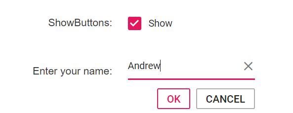

# Buttons

The In-place Editor had an action for save and cancel using buttons. The [`SaveButton`](https://help.syncfusion.com/cr/aspnetcore-js2/Syncfusion.EJ2.InPlaceEditor.InPlaceEditor.html#Syncfusion_EJ2_InPlaceEditor_InPlaceEditor_SaveButton) and [`CancelButton`](https://help.syncfusion.com/cr/aspnetcore-js2/Syncfusion.EJ2.InPlaceEditor.InPlaceEditor.html#Syncfusion_EJ2_InPlaceEditor_InPlaceEditor_CancelButton) properties accept the `ButtonModel` objects for customizing the save and cancel button properties.

Buttons can be show or hide by sets a Boolean value to the [`ShowButtons`](https://help.syncfusion.com/cr/aspnetcore-js2/Syncfusion.EJ2.InPlaceEditor.InPlaceEditor.html#Syncfusion_EJ2_InPlaceEditor_InPlaceEditor_ShowButtons) property.

> Without buttons value will be processed via the following ways.

* **`ActionOnBlur`**: By clicking out side the editor control get focus out and do action based on this property value.
* **`SubmitOnEnter`**: Pressing `Enter` key it performs the submit action, if this property set to `true`.

In the following sample, the `content` and `cssClass` properties of `Button` value assigned to the `SaveButton` and `CancelButton` properties to customize its appearance. Also check or uncheck a checkbox buttons render or removed from the editor.

To restrict either save or cancel button rendering into a DOM, simply pass empty object `{}` in the  `SaveButton` or `CancelButton` properties.

> For more details about buttons, refer this documentation section.





The output will be as follows.

## See Also

* [In-place editor buttons](./how-to/dynamic-edit-mode/)