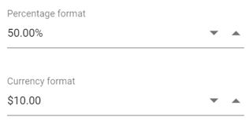
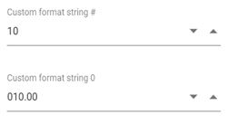

# Number Formats

You can format the value of NumericTextBox using [format](https://help.syncfusion.com/cr/aspnetcore-js2/Syncfusion.EJ2.Inputs.NumericTextBox.html#Syncfusion_EJ2_Inputs_NumericTextBox_Format) property.
The value will be displayed in the specified format when the control is in focused out state. The format string
supports both the [standard numeric format string](../common/internationalization/#supported-format-string)
and [custom numeric format string](../common/internationalization/#custom-number-formatting-and-parsing).

## Standard formats

From the [standard numeric format](../common/internationalization/#supported-format-string), you can use the numeric related
format specifiers such as `n`,`p` and `c` in the NumericTextBox control. By using these format specifiers, you can achieve the percentage
and currency textbox behavior also.

The below example demonstrates percentage and currency formats.





Output be like the below.

## Custom formats

From the [custom numeric format string](../common/internationalization#custom-number-formatting-and-parsing/), you can provide any custom format by
combining one or more custom specifiers.

The below examples demonstrate format the value by using currency format string `#` and `0`.





Output be like the below.

