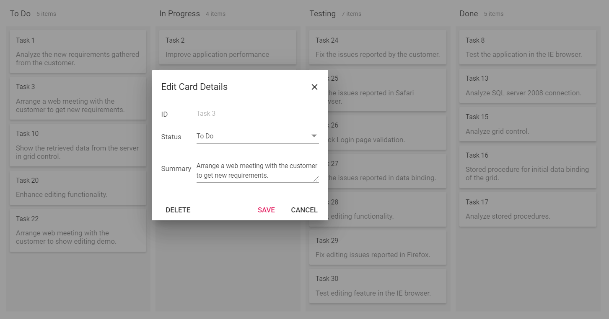
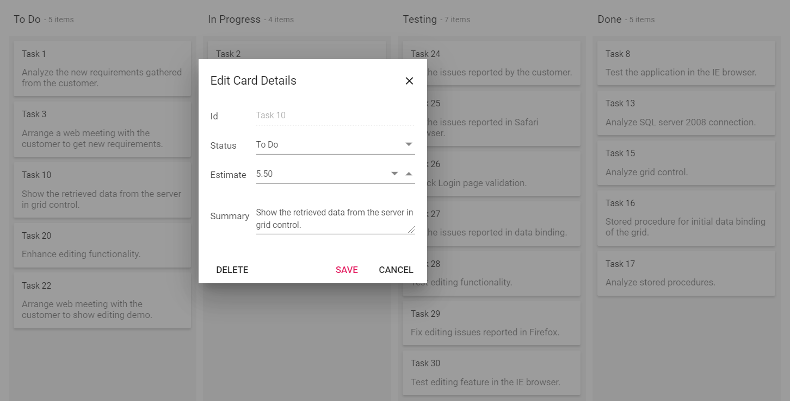
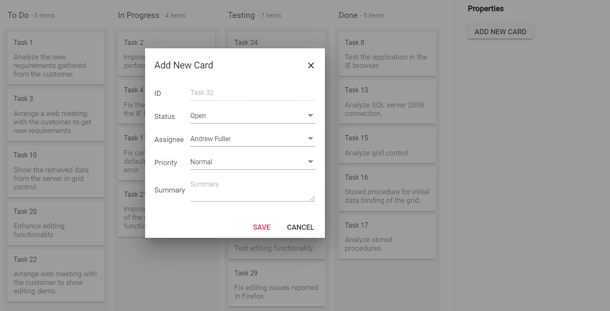

# Card Editing

The Kanban provides built-in support to add, edit and delete a card using dialog module. User can edit a card using the following ways.

* Built-in dialog module
* Custom Fields
* Dialog template

## Default Dialog

When double-click on the cards, the dialog is opened with below fields to edit a card. This dialog contains `Delete`, `Save` and `Cancel` buttons.

* To edit a card, modify the card details and click the `Save` button.
* To delete a card, click `Delete` button.
* Click on the `Cancel` button to cancel the editing action.

The dialog displays with the following fields which mapped to dialog fields by default.

Key | Type | Text
-----|-----|----
cardSettings.headerField | Input | ID
keyField | DropDown | -
cardSettings.contentField | TextArea | -
cardSettings.priority(If applicable) | Numeric | -
swimlaneSettings.keyField(If applicable) | DropDown | -





Output be like the below.



## Custom Fields

You can change the default fields of dialog using `Fields` property inside the `DialogSettings` property. The `Key` property used to map the DataSource value and rendered the corresponding component based on specified `Type` property.

The following types are available in dialog fields.

* String
* Numeric
* TextArea
* DropDown
* TextBox
* Input

> If `Type` is not defined in the fields, then it renders as the HTML input element in dialog.





Output be like the below.



### Custom Fields label

By default, the fields `Key` mapping value is considered as a `Label` and you can change this label by using `Text` property.





Output be like the below.


### Fields Validation

The dialog fields can be validated while click on the `Save` button. This can be achieved by using `ValidationRules` property.





## Dialog Template

Using the dialog template, you can render your own dialog by defining the `Template` property. Initialize the template as SCRIPT element Id or HTML string which holds the template and map it to the template property.





Output be like the below.



## Prevent Dialog

The Kanban allows to prevent to open a dialog on card double-click by enabling `args.cancel` in `DialogOpen` event.





## Persisting data in server

The modified card data can be persisted in the database using the RESTful web services. All the CRUD operations in the Kanban are done through `DataManager`. The `DataManager` has an option to bind all the CRUD related data in server-side.

> For your information, the ODataAdaptor persists data in the server as per OData protocol.

In the below section covers how to get the edited data details on the server-side using the `UrlAdaptor`.

### URL adaptor

You can use the `UrlAdaptor` of `DataManager` when binding data source for remote data. In the initial load of Kanban, data are fetched from remote data and bound to the Kanban using `Url` property of `DataManager`.

Using the `CrudUrl` property, the controller action URL can be specified to perform all the CRUD operations at server-side using a single method instead of specifying separate controller action method for CRUD (create, update and delete) operations. The action parameter of `CrudUrl` is used to get the corresponding CRUD action.





The server-side controller code to handle the CRUD operations are as follows.

```typescript

private NORTHWNDEntities db = new NORTHWNDEntities();
public ActionResult DataSource() {
    var DataSource = db.Tasks.ToList();
    return Json(DataSource, JsonRequestBehavior.AllowGet);
}
public ActionResult UpdateData(EditParams param) {
    if (param.action == "insert" || (param.action == "batch" && param.added != null)) {
        if (param.action == "insert") {
            db.Tasks.Add(param.value);
        } else {
            foreach (var temp in param.added) {
                db.Tasks.Add(temp);
            }
        }
    }
    if (param.action == "update" || (param.action == "batch" && param.changed != null)) {
        if (param.action == "update") {
            Task old = db.Tasks.Where(o => o.Id == param.value.Id).SingleOrDefault();
            if (old != null) {
                db.Entry(old).CurrentValues.SetValues(param.value);
            }
        } else {
            foreach (var temp in param.changed) {
                Task old = db.Tasks.Where(o => o.Id == temp.Id).SingleOrDefault();
                if (old != null) {
                    db.Entry(old).CurrentValues.SetValues(temp);
                }
            }
        }
    }
    if (param.action == "remove" || (param.action == "batch" && param.deleted != null)) {
        if (param.action == "remove") {
            int key = Convert.ToInt32(param.key);
            db.Tasks.Remove(db.Tasks.Where(o => o.Id == key).SingleOrDefault());
        } else {
            foreach (var temp in param.deleted) {
                db.Tasks.Remove(db.Tasks.Where(o => o.Id == temp.Id).SingleOrDefault());
            }
        }
    }
    db.SaveChanges();
    var data = db.Tasks.ToList();
    return Json(data, JsonRequestBehavior.AllowGet);
}

public class EditParams {
    public string key { get; set; }
    public string action { get; set; }
    public List<Tasks> added { get; set; }
    public List<Tasks> changed { get; set; }
    public List<Tasks> deleted { get; set; }
    public Tasks value { get; set; }
}
```
