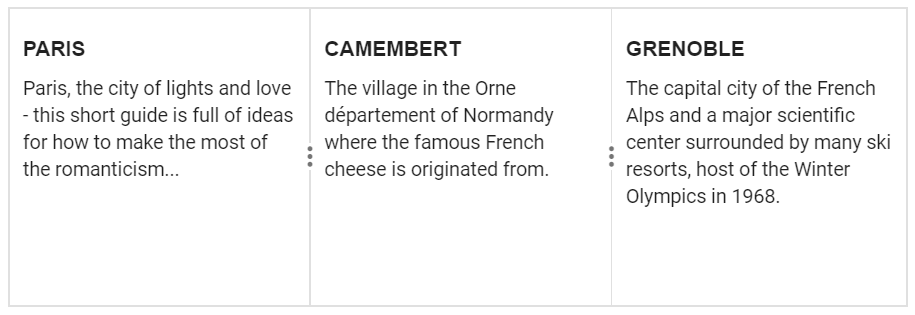
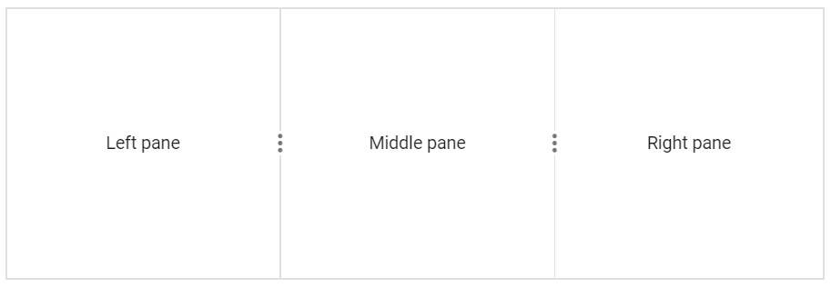

# Pane content

This section explains how to provide plain text content or HTML markup or integrate other Syncfusion ASP.NET MVC UI controls as content of splitter.

## HTML Markup

Splitter is a layout based container control. You can render the pane contents from existing HTML markups. Converting HTML markup as splitter pane is easy way to add the panes content dynamically.





Output be like the below.

## Syncfusion ASP.NET MVC UI controls

You can render any Syncfusion ASP.NET MVC UI controls along with their native and control events within splitter as pane content.

You can refer [Accordion within splitter](https://ej2.syncfusion.com/aspnetmvc/Splitter/AccordionNavigationMenu#/material) and [Listview within splitter](https://ej2.syncfusion.com/aspnetmvc/Splitter/DetailsView#/material) samples.

## Plain content

You can add the plain text as a pane contents using either inner HTML or [`Content`](https://help.syncfusion.com/cr/aspnetcore-js2/Syncfusion.EJ2.Layouts.Splitter.html#Syncfusion_EJ2_Layouts_Splitter_PaneSettings) API.





Output be like the below.

## Pane content using selector

You can set HTML element as pane content, using the query selectors such as ID or CSS class selectors.

The following code demonstrates how to fetch an element from the document and load it to pane using its ID.





Output be like the below.

