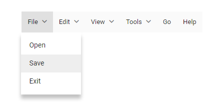

# Getting Started

This section briefly explains about how to include a simple Menu in your ASP.NET MVC application. You can refer [ASP.NET MVC Getting Started documentation](../getting-started) page for introduction part of the system requirements and configure the common specifications.

## Add Menu to the project

We are going to render `Menu` control in **Index.cshtml** page.





`ViewBag.menuItems` variable is used for bounding the `items` property in view page.

## Bind datasource

The menu items can be rendered by assigning JSON values to `ViewBag` variable in `Default.cs`, and passed to the
[`items`](https://help.syncfusion.com/cr/cref_files/aspnetcore-js2/Syncfusion.EJ2~Syncfusion.EJ2.Navigations.Menu~Items.html) property in the view

```cs
public ActionResult Index()
    {
            //define the array of JSON
            List<object> menuItems = new List<object>() {
            new {
                    text= "File",
                    items= new List<object>(){
                        new { text= "Open" },
                        new { text= "Save" },
                        new { text= "Exit" }
                    }
                },
                new
                {
                    text = "Edit",
                    items = new List<object>(){
                        new { text= "Cut" },
                        new { text= "Copy" },
                        new { text= "Paste" }
                    }
                },
                new {
                    text= "View",
                    items= new List<object>(){
                        new { text= "Toolbar" },
                        new { text= "Sidebar" },
                        new { text= "Full Screen" }
                    }
                },
                   new {
                   text= "Tools",
                   items= new List<object>(){
                       new { text= "Spelling & Grammar" },
                       new { text= "Customize" },
                       new { text= "Options" }
                    }
                },
                new {  text= "Go" },
                new {  text= "Help" },
            };

            ViewBag.menuItems = menuItems;
            return View();
    }

```

Output be like the below.



## Run the application

 After successful compilation of your application, simply press `F5` to run the application.

 The following example shows a basic Menu.





> This example demonstrates the basic rendering of Menu with items support.
For more information about data source support,
refer to the [`Data Source Binding`](./data-source-binding-and-custom-menu-items#data-binding) section.

## Group menu items with separator

The separators are both horizontal and vertical lines used to separate the menu items.
You cannot select the separators, but you can enable separators to group the menu items
using the `separator` property.
The `Open` and `Save` sub menu items are grouped using the `separator` property in the following sample.





> The `separator` property should not be given
along with the other fields in the `MenuItem`.
You can also enable the separator to group **horizontal** menu items.

## See Also

* [Create menu using data source](./data-source-binding-and-custom-menu-items#data-binding)
* [Customize menu items using template support](./data-source-binding-and-custom-menu-items#custom-menu-items)
* [Integrating with Toolbar component](./use-case-scenarios#menu-in-toolbar)